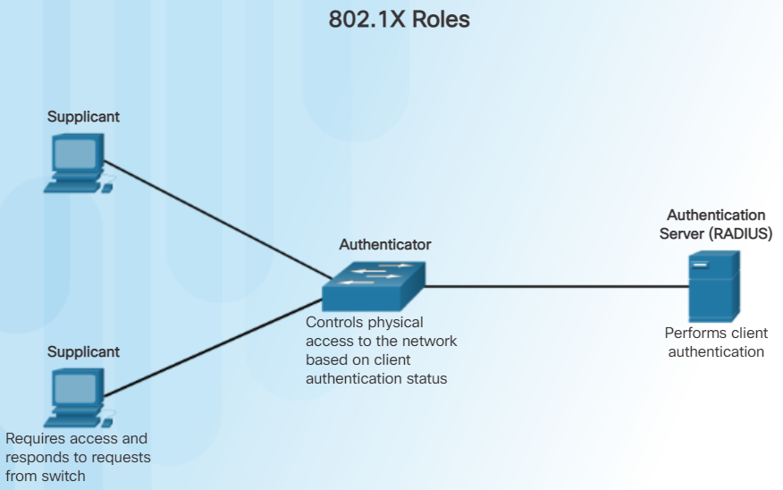
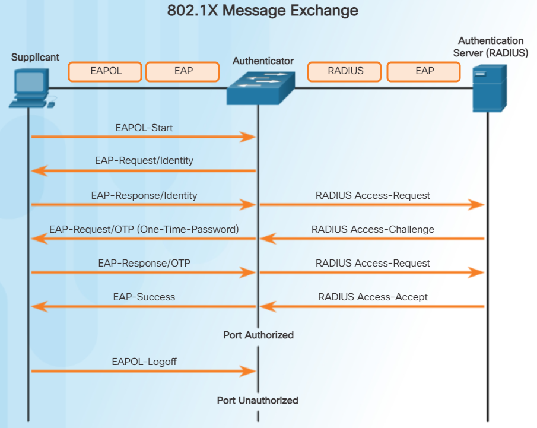
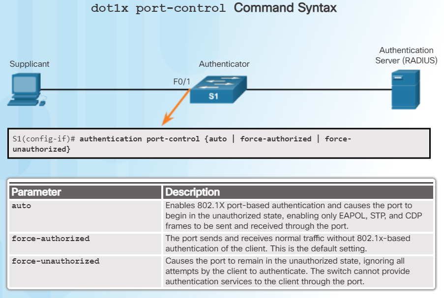
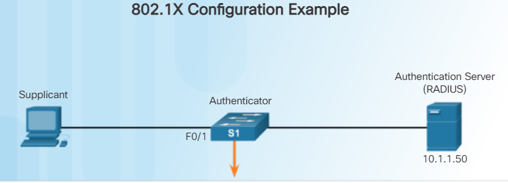

802.1X Authentication
=====================

The IEEE 802.1X standard defines a port-based access control and 
authentication protocol that restricts unauthorized workstations 
from connecting to a LAN through publicly accessible switch ports. 
The authentication server authenticates each workstation 
that is connected to a switch port before making available 
any services offered by the switch or the LAN.

* Supplicant (Client) 
    - The device (workstation) that requests access to LAN 
      and switch services and then responds to requests from the switch. 
      The workstation must be running 802.1X-compliant client software. 
      (The port that the client is attached to 
      is the supplicant [client] in the IEEE 802.1X specification.)
* Authenticator (Switch) 
    - Controls physical access to the network based on the authentication 
      status of the client. 
      The switch acts as an intermediary (proxy) 
      between the client (supplicant) and the authentication server, 
      requesting identifying information from the client, 
      verifying that information with the authentication server, 
      and relaying a response to the client. 
      The switch uses a RADIUS software agent, 
      which is responsible for encapsulating 
      and de-encapsulating the EAP (Extensible Authentication Protocol) 
      frames and interacting with the authentication server.
* Authentication server 
    - Performs the actual authentication of the client. 
      The authentication server validates the identity of the client 
      and notifies the switch whether the client is authorized 
      to access the LAN and switch services. 
      Because the switch acts as the proxy, the authentication service 
      is transparent to the client. 
      The RADIUS security system with EAP extensions 
      is the only supported authentication server.
      
802.1X Port Authorization State
-------------------------------
If the client is successfully authenticated 
(receives an “accept” frame from the authentication server), 
the port state changes to authorized, 
and all frames from the authenticated client are enabled through the port.

If the authentication fails, the port remains in the unauthorized state, 
but authentication can be retried. 
If the authentication server cannot be reached, 
the switch can retransmit the request. 
If no response is received from the server 
after the specified number of attempts, authentication fails, 
and network access is not granted.

When a client logs out, it sends an EAPOL-logout message, 
causing the switch port to transition to the unauthorized state.

If the link state of a port changes from up to down, 
or if an EAPOL-logoff frame is received, 
the port returns to the unauthorized state.

Configuring 802.1X
------------------
1. Enable AAA using the aaa new-model command and configure the RADIUS server.

2. Create an 802.1X port-based authentication method list using the `aaa authentication dot1x` command.

3. Globally enable 802.1X port-based authentication using the `dot1x system-auth-control` command.

4. Enable port-based authentication on the interface using the `authentication port-control auto` command.

5. Enable 802.1X authentication on the interface using the `dot1x pae` command. 
   The `authenticator` options sets the Port Access Entity (PAE) type, 
   so the interface acts only as an authenticator 
   and will not respond to any messages meant for a supplicant.

    S1(config)# aaa new-model
    S1(config)# radius server Radius-Server
    S1(config-radius-server)# address ipv4 10.1.1.50 auth-port 1812 acct-port 1813
    S1(config-radius-server)# key RADIUS-Pa55w0rd
    S1(config-radius-server)# exit
    S1(config)# aaa authentication dot1x default group radius
    S1(config)# dot1x system-auth-control
    S1(config)# interface F0/1
    S1(config-if)# description Access Port
    S1(config-if)# switchport mode access
    S1(config-if)# authentication port-control auto
    S1(config-if)# dot1x pae authenticator